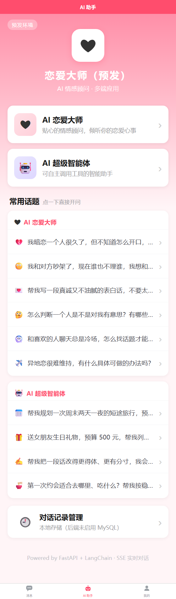
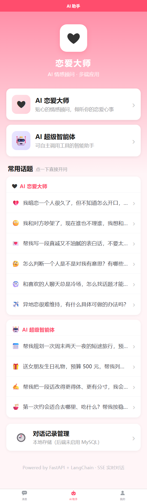

# 环境配置说明（开发 / 预发 / 生产分层）

> 一句话：**密钥只存在于「不入库的那一层」，其余所有分层文件都可以安全提交到 Git。**
> 后端切换环境只改一个变量 `APP_ENV`；前端切换环境只改一个 `--mode`。

---

## 一、总览：两条独立的环境线

前后端是**两套互相独立**的环境机制，别混在一起想：

```
后端（Python / FastAPI）                   前端（uni-app / Vite）
  APP_ENV = dev | test | staging | prod      --mode development | staging | e2e | production
  ↓                                          ↓
  .env → .env.<APP_ENV> → 系统环境变量        .env → .env.<mode> → .env.<mode>.local
  ↓                                          ↓
  端口 / DEBUG / MySQL / RAG / 短信          后端地址 / 应用标题
```

**关键区别**：后端读的是**服务端机器上的文件或环境变量**；前端是**编译期静态注入**——
`.env.production` 里的值在 `npm run build:h5` 那一刻被写死进 JS 产物，发布后改不了。
所以「前端连错后端」只能重新构建，这一点在排查时最容易搞混。

---

## 二、后端环境分层

### 2.1 加载顺序（后面的覆盖前面的）

| 顺序 | 文件 | 是否入库 | 职责 |
|---|---|---|---|
| 1 | `.env` | ❌ **不入库**（`.gitignore` 已排除） | 本机实际配置：**安全基线** + 所有密钥 |
| 2 | `.env.<APP_ENV>` | ✅ 入库 | 该环境的覆盖项，**禁止写任何密钥** |
| 3 | 系统环境变量 | — | 最高优先级：云托管控制台 / CI / 命令行临时覆盖 |

> **为什么 `.env` 里是 `DEBUG=false` 而不是 `true`？**
> 它同时扮演两个角色：本机配置，以及「所有环境的共同基线」。
> 基线刻意选**生产安全**的取值（`DEBUG=false`），这样即使某个环境文件漏配了某一项，
> 也是往安全的方向失败，而不会意外把调试开关打开。
> 开发环境要开调试，由 `.env.dev` 里的 `DEBUG=true` 显式覆盖 —— 所以本地跑起来
> 横幅仍然显示「调试模式: True」。

`APP_ENV` 本身按这个优先级解析：

```
系统环境变量 APP_ENV  >  .env 文件里的 APP_ENV  >  "dev"
```

> 实现见 `app/config/settings.py::resolve_env_name()`。
> 之所以要「在 `BaseSettings` 定义之前就把 `APP_ENV` 读出来」，是因为
> `env_file` 是类属性、在类定义时求值——不先解析就不知道要加载哪个文件。

### 2.2 环境名与别名

写错环境名不会报错，只会静默退回 `dev`，所以做了别名映射（`_ENV_ALIASES`）：

| 标准名 | 可用别名 |
|---|---|
| `dev` | `development` `local` `debug` |
| `test` | `testing` `unittest` |
| `staging` | `stage` `pre` `uat` |
| `prod` | `production` `online` `release` `cloudrun` `cloud` |

### 2.3 四个环境的差异对照

| 配置项 | dev | test | staging | prod |
|---|---|---|---|---|
| `DEBUG` | `true` | `true` | `false` | `false` |
| `PORT` | `8000` | `8000` | `8000` | `80` |
| `CORS_ORIGINS` | `["*"]` | `["*"]` | 按需 | 收敛为具体域名 |
| `MYSQL_ENABLED` | `false` | `false` | 按需 | `true` |
| `RAG_BACKEND` | `local` | `local` | 按需 | `bailian` |
| `SMS_PROVIDER` | `none`（回显验证码） | `none` | `tencent` | `tencent` |
| `JWT_SECRET` | 留空（内置开发密钥） | 留空 | 必填 | **必填** |
| `LLM_LOG_ENABLED` | `true` | `false` | `false` | `false` |

> 仓库里目前只放了两份：`.env.dev`、`.env.prod`。
> 需要 `test` / `staging` 时**直接复制改名**即可，不用改一行代码。

### 2.4 后端文件职责

| 文件 | 用途 | 能否入库 |
|---|---|---|
| `.env` | 本机真实配置 + 所有密钥 | ❌ 绝不 |
| `.env.dev` | 开发环境开关（提交） | ✅ |
| `.env.prod` | 生产环境开关（提交）；同时是「生产该配什么」的版本化清单 | ✅ |
| `.env.example` | 全量变量模板 + 注释说明 | ✅ |
| `.env.cloudrun.example` | 云托管控制台环境变量清单（照抄逐项填） | ✅ |

### 2.5 常用操作

```bash
# 方式一（推荐本地开发）：直接改 .env 里的一行，然后正常启动
APP_ENV=dev python main.py

# 方式二：临时切环境，不动文件
#   Windows CMD
set APP_ENV=prod && python main.py
#   PowerShell
$env:APP_ENV="prod"; python main.py
#   Git Bash / Linux / macOS
APP_ENV=prod python main.py

# 生成生产用 JWT 签名密钥（64 位十六进制）
python -c "import secrets;print(secrets.token_hex(32))"
```

### 2.6 启动自检

启动时控制台会打印横幅，**第一眼看的就是「运行环境」和「配置文件」两行**：

```
============================================================
恋爱大师 启动中...
运行环境: dev
配置文件: .env → .env.dev
监听地址: 0.0.0.0:8000 | 调试模式: True
对话模型: qwen-plus
大模型配置: 未配置(仅接口可用)
RAG 数据源: local（请求 local）
对话历史存储: 未启用(由前端本地存储承担)
账号体系: 开启 | 短信通道: none | Token 密钥: 内置开发密钥
============================================================
```

生产模式下会追加告警（示例）：

```
⚠️  配置告警：CORS_ORIGINS=*：生产建议收敛为具体域名
🔒 安全告警：JWT_SECRET 未配置：正在使用内置开发密钥……（仅日志输出）
```

**注意这两类告警的区别**——它们刻意走了不同通道：

| 告警属性 | 走哪 | 原因 |
|---|---|---|
| `config_warnings` | 日志 **+ `/api/health/config` 接口** | 内容可公开（DEBUG 没关、CORS 太宽等） |
| `jwt_warning` | **仅服务端日志** | 「你的密钥还是内置默认值」等于告诉攻击者可以拿源码伪造 token |

同一个信息也能通过接口拿到（不含任何密钥）：

```bash
curl http://localhost:8000/api/health/config
```

```json
{
  "env": "dev",
  "envFiles": [".env", ".env.dev"],
  "debug": true,
  "llm": "missing",
  "ragRequested": "local",
  "ragEffective": "local",
  "historyDb": "off(本地存储)",
  "auth": true,
  "sms": "none",
  "smsDevCodeExposed": true,
  "warnings": []
}
```

> `ragRequested` 与 `ragEffective` 是两个字段：配了 `bailian` 但业务空间 ID /
> 知识库 ID 没填全时会自动回退 `local`。只看一个字段会误判成「配置没生效」。

---

## 三、前端环境分层

### 3.1 四种构建模式

| 模式 | 配置文件 | 启动 / 构建脚本 | 后端地址 |
|---|---|---|---|
| `development` | `.env.development` | `npm run dev:h5` 等 | `http://localhost:8000/api` |
| `staging` | `.env.staging` | `npm run build:h5:staging` | 预发地址（局域网 / 预发域名） |
| `e2e` | `.env.e2e` | `npm run build:h5:e2e` | `http://127.0.0.1:8011/api`（本地测试后端） |
| `production` | `.env.production` | `npm run build:h5` 等 | 微信云托管公网域名 |

加载规则（Vite）：`.env` → `.env.[mode]` → `.env.[mode].local`，后者覆盖前者；
`*.local` 已被 `.gitignore` 排除，用来放「本机私有覆盖」。

### 3.2 变量表

| 变量 | 说明 |
|---|---|
| `VITE_API_BASE_URL` | 普通接口地址，通常以 `/api` 结尾 |
| `VITE_SSE_BASE_URL` | SSE 流式地址。三端都不走 Vite 代理，**必须完整地址**，不能写 `/api` |
| `VITE_APP_TITLE` | 应用标题。显示在「AI 助手」页大标题、H5 标签页、「我的」页应用名称 |

### 3.3 两个必踩的坑

1. **只有 `VITE_` 前缀会被注入**，其它前缀前端读不到。
2. 必须写成 `import.meta.env.VITE_XXX` 这种**直接成员访问**。
   ```js
   // ✅ 正确
   const url = import.meta.env.VITE_API_BASE_URL
   // ❌ 错误：三端都取不到值
   const env = import.meta.env
   const url = env.VITE_API_BASE_URL
   ```
   因为 Vite 是在构建时做**静态文本替换**，不经过运行时对象。

### 3.4 界面上的环境标识（防拿错包）

光看配置不容易发现自己跑的是哪个环境，所以界面上做了显式标识。
**注意这些标识一律只出现在「AI 助手」页与「我的」页，不出现在会话列表首页** ——
首页是给用户看的地方，混进调试信息会显得很业余（这条已固化成回归测试
`tmp/test_frontend_build.py` 的第 7 节，防止以后又漏回首页）：

- **「AI 助手」页左上角环境角标**：非生产构建才渲染，显示「本地开发 / 预发环境 / 端到端测试」。
- **「AI 助手」页大标题**：绑定 `VITE_APP_TITLE`，预发包显示「恋爱大师（预发）」。
- **H5 浏览器标签页标题**：`pages.json` 是静态 JSON 注入不了变量，改为在首页
  `onLoad` 里调 `uni.setNavigationBarTitle({ title: APP_TITLE })` 运行时设置。
- **「我的」页 → 关于**：显示运行环境、编译默认地址；「连接」分组显示当前服务器地址。
  所有排查用的信息都收在这里，需要时才进来看。

生产包以上标识全部消失（无角标、标题就是「恋爱大师」、关于里也没有调试项）。

实际效果对比（同一份代码，只改 `--mode`）：


| 预发构建 `build:h5:staging` | 生产构建 `build:h5` |
|---|---|
|  |  |

左边一眼就能看出是预发包（左上角角标 + 标题后缀 + 底部编译地址），
右边保持干净。这样拿错包联调的情况基本可以杜绝。

> 复现这两张图：`python tmp/shot_env.py`

### 3.5 前端文件职责

| 文件 | 用途 | 能否入库 |
|---|---|---|
| `.env.development` | 本地开发 | ✅ |
| `.env.production` | 生产（**上线前必须换成真实 https 域名**） | ✅ |
| `.env.staging` | 预发 | ✅ |
| `.env.e2e` | 自动化端到端测试专用，验证完可删 | ✅ |
| `.env.example` | 模板与规则说明（不会被自动加载） | ✅ |
| `*.local` | 本机私有覆盖 | ❌ |

### 3.6 运行时可覆盖（App 专用）

App 打包后 `localhost` 指手机自身，必须填电脑局域网 IP；而电脑 IP 会变，
写死意味着每次变动都要重新云打包。因此支持**运行时代理**：

「我的」→ 服务器地址 → 修改 → 存本地存储（键 `LM_SERVER_BASE`）→ 立即生效。

优先级：**本地存储 > `.env.<mode>` 编译期值 > 代码兜底默认值**。

### 3.7 ICP 备案信息（上线合规）

境内运营需要在显著位置标注备案号并链接工信部备案系统
（`https://beian.miit.gov.cn`）。这两项也走环境变量，按环境配置：

| 变量 | 说明 | 必填 |
|---|---|---|
| `VITE_BEIAN_ICP` | 网站备案号，本项目为 `闽ICP备2022001906号` | ✅ 已填 |
| `VITE_BEIAN_OWNER` | 备案主体全称（公司 / 个人姓名） | 可选（未确认就先留空） |
| `VITE_BEIAN_POLICE` | 公安备案号，形如 `闽公网安备35010002000000号` | 可选 |

几个约定：

- **未配置时显示「备案号待配置」占位**，而不是留空 —— 界面照常可跑，
  但一眼能看出这里还没填真号，不会上线后才发现；
- 代码里有一个**明显假的哨兵值**（`闽ICP备0000000000号-0`）用来识别「忘了替换」。
  真实号码不会与它相等，所以填上真号后 `BEIAN.isPlaceholder` 就是 `false`；
- 主体名称留空时界面只显示号码，不会出现多余空格（填错主体名比不填更麻烦）；
- **只有 H5 展示备案号**：靠模板条件编译（`<!-- #ifdef H5 -->`）整段剔除，
  小程序 / App 产物里没有这个节点。原因见 `docs/界面结构说明.md` 的
  「备案信息（ICP）」一节；
- `tmp/test_frontend_build.py` 第 8 节会断言：生产 H5 包包含真实备案号、
  预发包不混入生产号、生产包里不残留哨兵值；第 11 节断言小程序 / App 产物
  不含备案入口；
- 展示位置：「我的」页底部居中（`docs/screenshots/ui-04b-我的-已登录.png`）。

> ⚠️ 微信小程序**无法在应用内打开外部网页**（`web-view` 只加载配置过业务域名的页面，
> 工信部网址配不了）。这也是小程序端不展示备案入口的原因之一 —— 展示一个点了
> 没反应的入口比不展示更糟。相关分派逻辑保留在 `uniapp/src/utils/beian.js`。

---

## 四、云托管（生产）环境变量

云上 `.env*` 全被 `.dockerignore` 排除，配置**一律来自控制台环境变量**——
这样镜像里永远不含密钥。完整清单照抄 `.env.cloudrun.example`。

最少需要配的几项：

| 变量 | 说明 |
|---|---|
| `APP_ENV=prod` | 决定加载哪套环境（云上没有 `.env.prod` 文件，走系统环境变量） |
| `PORT=80` | 与控制台「新建版本」填的端口保持一致 |
| `DEBUG=false` | 开着会暴露异常堆栈与内部路径 |
| `DASHSCOPE_API_KEY` | 不填只能跑通接口、无法真正对话 |
| `MYSQL_*` | 容器文件系统不持久，历史记录必须落库 |
| `JWT_SECRET` | **必填**，漏配会退回内置密钥 → 登录态可被伪造 |
| `SMS_PROVIDER=tencent` + `TENCENT_*` 5 项 | 不配则验证码接口直接 503（刻意设计，见下） |
| `WECHAT_MINIAPP_APPID/SECRET` | 小程序静默登录需要，Secret 绝不能下发前端 |

> 可用脚本从本地 `.env` 生成可粘贴内容：
> `python tmp/gen_cloudrun_env.py` → `tmp/cloudrun_env.json` / `_array.json` / `.txt`

---

## 五、安全红线

| 红线 | 原因 |
|---|---|
| `.env` 绝不入库 | 里面是所有密钥 |
| `.env.*`（分层文件）禁止写密钥 | 这些是入库的 |
| 生产禁止回显短信验证码 | 回显 = 任何人用任意手机号请求即可拿到码接管账号 |
| 密钥类告警不进 HTTP 响应 | 等于告诉攻击者「可以拿源码里的默认密钥伪造 token」 |
| `DASHSCOPE_API_KEY` / `WECHAT_MINIAPP_SECRET` / `*_PASSWORD` 只放服务端 | 前端产物是公开的 |

生产环境回显验证码的行为由这个属性统一裁决：

```
sms_dev_code_exposed = 是开发模式短信 AND (非生产 OR 显式放行 SMS_ALLOW_DEV_CODE_IN_PROD)
```

也就是说，`APP_ENV=prod` + `SMS_PROVIDER=none` 的组合下，
`/api/auth/sms/send` 会**直接返回 503**，而不是回显验证码。

---

## 六、排查「我改了配置却不生效」

按这三步走，基本都能定位：

1. **看启动横幅的「配置文件」那一行**
   少文件就是文件名或 `APP_ENV` 写错了。
   例：改的是 `.env.prod` 但横幅显示 `.env → .env.dev` → `APP_ENV` 还是 `dev`。

2. **看环境名有没有落到别名外**
   写 `PROD` 能识别（大小写不敏感），但写 `prd` / `product` 不在别名表里 →
   会按字面去找 `.env.prd`，找不到就只剩 `.env`，等于分层失效。
   检查方式：`curl /api/health/config` 看 `env` 字段。

3. **确认改的是「哪一端」的配置**
   | 现象 | 原因 |
   |---|---|
   | 后端改了没反应 | 服务没重启（`DEBUG=false` 时不会热重载） |
   | 前端改了没反应 | 前端是**编译期注入**，必须重新 `build` 才生效 |
   | 云上改了没反应 | 改了环境变量后需**重新发布版本**才生效 |

补充：系统环境变量优先级最高。若某值怎么改都不对，先确认 shell 或控制台里
有没有同名的环境变量在覆盖它。

---

## 七、上线前检查清单

- [ ] 后端 `APP_ENV=prod`，横幅显示「运行环境: prod（生产）」
- [ ] `JWT_SECRET` 已配置强随机 64 位十六进制，启动时**无** 🔒 安全告警
- [ ] `SMS_PROVIDER=tencent` 且腾讯云短信 5 项参数齐全
- [ ] `CORS_ORIGINS` 已收敛为具体域名（不是 `["*"]`）
- [ ] `MYSQL_ENABLED=true` 且连接的是**内网**地址
- [ ] 前端 `.env.production` 里的地址是真实 https 域名，不是 `localhost`
- [ ] `npm run build:h5` 产物中 grep 不到 `localhost` / 预发 IP
- [ ] 界面无环境角标（生产包不显示）
- [ ] 小程序「服务器域名」已配置 request 合法域名，且为 https

---

## 八、相关文件索引

| 类别 | 路径 |
|---|---|
| 后端配置实现 | `app/config/settings.py`、`app/config/__init__.py` |
| 后端启动横幅 | `app/main.py::_log_startup_banner` |
| 配置自检接口 | `app/api/system.py::health_config` |
| 后端环境文件 | `.env`、`.env.dev`、`.env.prod`、`.env.example`、`.env.cloudrun.example` |
| 前端环境文件 | `uniapp/.env.development` / `.production` / `.staging` / `.e2e` / `.example` |
| 前端读取入口 | `uniapp/src/config/index.js` |
| 前端构建脚本 | `uniapp/package.json` |
| 后端回归测试 | `tmp/test_env_config.py`（18 项） |
| 前端产物回归测试 | `tmp/test_frontend_build.py`（18 项） |
| 云端变量生成 | `tmp/gen_cloudrun_env.py` |

### 怎么跑这两个回归测试

```bash
# 后端：环境分层 + 密钥不外泄 + 生产禁回显验证码
python tmp/test_env_config.py

# 前端：先构建，再校验产物
cd uniapp
npm run build:h5 && npm run build:mp-weixin && npm run build:app
UNI_OUTPUT_DIR=dist/build/h5-staging npm run build:h5:staging
cd ..
python tmp/test_frontend_build.py
```

> 前端测试必须跑在**真实产物**上，不能只读源码——它的主要价值就是抓
> 「源码看着对、编译出来是另一回事」这类问题（例如漏写 `#ifdef` 导致
> 平台专有代码被打进所有端的产物）。
